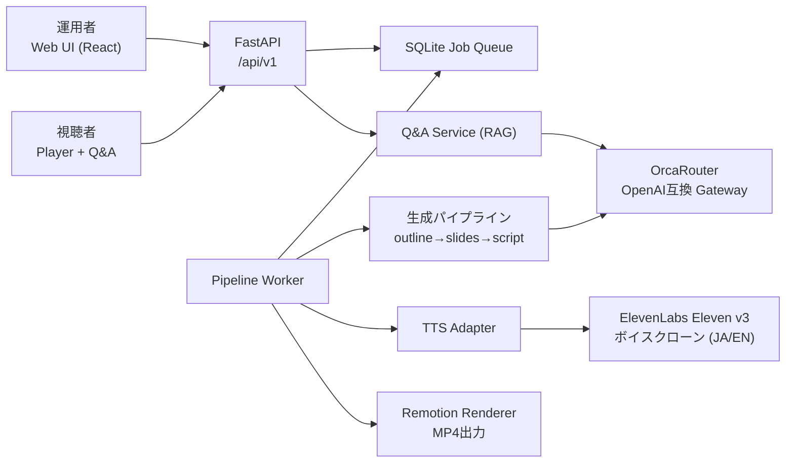

# 資料を渡すと「自分の声」でウェビナー動画ができる — AIウェビナーエージェント「Koebinar」を作った

> 公開前に`<デモURL>`と`<リポジトリURL または 非公開>`を置換する記事ドラフトです。
>
> *あなたの声が、あなたの代わりに登壇する。*

ハッカソン **AI HACK** で「Koebinar（コエビナー）」というAIウェビナーエージェントを約1週間で開発しました。この記事では、何を作ったか・どう作ったか・設計上の判断を紹介します。

- デモ環境: `<デモURL>`（**BYOK方式**: OrcaRouter / ElevenLabs のAPIキーをご自身で持ち込んで試す形です。詳細は後述）
- リポジトリ: `<リポジトリURL または 非公開>`

## Koebinar とは

**企業の資料（PDF / PPTX / テキスト）を渡すと、クローン音声ナレーション付きのウェビナー動画（MP4）を自動生成し、視聴中の質問にも資料の根拠付きで答える** AIウェビナーエージェントです。

一言でいうと:

> 「資料を渡すと、指定した声でしゃべるウェビナー動画（MP4）が出てきて、視聴者の質問にもその資料の根拠付きで答えるAIレイヤー」

### 解決したい課題

| 課題 | 現状 | Koebinar |
|---|---|---|
| ウェビナー制作コスト | 台本作成・収録・編集に数日〜数週間 | 資料投入から数十分でナレーション付き動画 |
| 登壇者の確保 | 話者のスケジュール・撮り直しが制約 | クローン音声で「本人の声」のまま量産・修正 |
| 多言語展開 | 言語ごとに収録し直し | 台本翻訳 + **同一クローンVoice** で日英両版を生成 |
| 録画ウェビナーの低い対話性 | 見るだけで離脱しやすい | その場で質問できるRAG Q&A（根拠付き回答） |
| 質問が営業データにならない | チャットログが未活用 | 質問を構造化してCSV/JSONエクスポート |

「録画ウェビナー」と「ライブウェビナー」の中間、**非同期だけど対話できる**動画体験を狙っています。

## デモの流れ

1. 運用者コンソールにログインし、連携設定画面で **自分の OrcaRouter / ElevenLabs APIキーを登録**（BYOK）
2. PDF / PPTX をドラッグ&ドロップで登録（テキスト抽出は**ブラウザ内で完結**、サーバーには抽出済みテキストだけが送られる）
3. テーマ・尺・言語・追加指示を指定してウェビナー作成 → 非同期パイプラインが走る（Voice IDはAPIでは指定可能。同期済みVoiceを選ぶ作成UIは今後の対応）
4. 台本を確認・修正 → 該当ステップから再生成
5. 完成した動画を明示的に「公開」すると、認証不要の視聴者ページ `/watch/{id}` で再生 + Q&A ができる

## アーキテクチャ



技術スタック:

- **API**: Python / FastAPI + SQLite（メタデータ・ジョブキュー）+ ファイルシステム（成果物）
- **Worker**: SQLiteジョブをclaimしてパイプラインを実行する別プロセス
- **LLM**: OrcaRouter（OpenAI互換ゲートウェイ）経由
- **TTS**: ElevenLabs Eleven v3（Instant Voice Clone）
- **レンダリング**: Remotion（React でスライドを書き、音声と同期合成して 1080p/30fps H.264 MP4 を出力）
- **フロント**: Vite + React + TypeScript（運用者コンソール + 視聴者ページ）

外部インフラは Postgres も Redis も使わず **SQLite + FS だけ**。1週間ハッカソンで「動くこと」を最優先にした構成ですが、API/Worker のプロセス分離と永続ジョブキューは最初から入れており、キュー実装を差し替えれば水平分散に進める形にしています。

## 動画生成パイプライン: 6ステップ + 任意ステップ再実行

動画生成は6ステップに分割し、**各ステップの中間生成物をJSON・音声・動画ファイルとして永続化**しています。

| Step | 処理 | 出力 |
|---|---|---|
| 1 | アウトライン生成（LLM） | outline.json |
| 2 | スライド生成（LLM） | slides.json（Remotion component の props） |
| 3 | 台本生成（LLM、KB根拠付き） | script.json |
| 4a | TTSスクリプト整形（発音辞書適用） | tts_script.json |
| 4b | 音声合成（ElevenLabs） | audio/*（実レスポンスに応じたMP3/WAV）+ durations.json |
| 5 | タイムライン構築 | timeline.json |
| 6 | Remotionレンダリング | webinar.mp4 |

このステップ分割の価値は **「任意ステップからの再実行」** にあります。

- 台本を直したら → Step 4a から再実行（アウトライン・スライドは再生成しない）
- 固有名詞の読みが変だったら → 発音辞書に追記して TTS ステップを再実行

日本語TTSは漢字の読み誤りが避けられないので、音声は**文単位で分割生成**し、同一テキスト×Voice×設定のハッシュで**生成キャッシュ**しています。台本を修正してTTSステップを再実行すると、変更していない文はキャッシュヒットでスキップされ、**変更した文だけが再合成**されます。全文を作り直さないので、ElevenLabsのクレジットも無駄に消費しません。発音辞書はTSV形式（`用語→カナ`）でStep 4aで適用します（現状はサーバー側での辞書管理。UIからの辞書編集や、特定の文を指定したピンポイントのリテイクUIはPhase 2の課題です）。

### スライドはReactコンポーネント

スライドを画像生成やPPTXではなく **Remotion の React コンポーネント + props（slides.json）** として表現したのが個人的に気に入っているポイントです。

- LLMには「構造化されたprops」を出させるだけでよく、レイアウト崩れがない
- durations.json（各文の音声長）から `durationInFrames` を計算し、`<Audio>` をスライド区間に配置するだけで音声同期が完成する
- テーマ（tech / casual / formal）はコンポーネント側で差し替え

## ボイスクローンで「本人の声のまま」日英2バージョン

ElevenLabs の Instant Voice Clone で登録した **1つの voice_id を日本語・英語の両方で使う**ことで、「本人の声のまま英語版も出す」を実現しています。多言語展開のたびに収録し直す必要がなく、Eleven v3 は日本語品質も実用レベルでした。

なお、Voice一覧の取得だけでは利用同意になりません。クローンVoiceは、運用者が話者本人の同意取得と利用条件を確認し、Voiceごとに明示的な証跡を記録してから利用可能になります。証跡はワークスペース、Voice ID、確認時刻、実行主体、確認文バージョンに紐づき、取消後は新しい生成を拒否します。生成動画にはAI生成である旨の表記を入れる方針です。

## BYOK（Bring Your Own Key）設計

デモ環境は **BYOK方式** です。OrcaRouter / ElevenLabs のAPIキーはシステム側で共有せず、運用者が自分のキーを登録して使います。

- キーはアプリ層で暗号化してDB保存（マスターキーは環境変数）。復号は外部API呼び出し直前のサーバー側処理のみ
- 登録後のUI・API・ログには末尾4桁のマスク表示のみ。サーバーは保存済みキーの全文をブラウザへ返さない
- 登録時に軽量API（モデル一覧、ElevenLabs Voice一覧等）でキーを検証。ElevenLabsのUser Read（`user_read`）が許可されている場合はプラン・クレジット残量（使用文字数/上限）も表示し、権限がない場合は接続を妨げず表示不能の警告を出す。利用条件に関する警告と確認チェックを要求する
- キー解決順序は全プロバイダー共通で「①運用者の登録キー → ②システムのフォールバックキー（構成フラグで明示的に有効化したときのみ）」

利用料・クレジット・利用規約が各運用者のアカウントに帰属するので、共有デモ環境でもコスト管理と責任分界が明確になります。ワークスペース（テナント）単位でデータとBYOKを分離しており、Bearerトークンからサーバー側でテナントを解決し、他テナントのリソースIDは404として扱います。

## RAG Q&A: 「答えない」を実装する

視聴者ページのQ&Aは、登録資料をチャンク化したKBに対するRAGです。検索はMVPでは意図的に軽量な実装で、**語彙オーバーラップ + hashing-trick bag-of-wordsのハイブリッドスコア**（外部依存ゼロ・決定論的）を使っています。embeddingモデルによる意味検索はPhase 2の課題です。上位10件を取得して上位5件をcontextに詰め、回答はOrcaRouterのJSONモードで構造化出力させます:

```json
{
  "answer_text": "...",
  "confidence": 0.85,
  "citations": [{"document_id": "...", "chunk_id": "..."}],
  "answerability": "answerable | insufficient | restricted"
}
```

**citation なし、または confidence < 0.7 の回答は定型の保留文に差し替え**（Confidence Gate）、資料に根拠のない質問には「担当者が確認します」と返します。企業ナレッジを名乗るQ&Aで一番怖いのはハルシネーションなので、「答えない」を仕様として持たせました。ゲートは3層あります:

1. **検索が弱ければLLMを呼ばない** — 検索スコアから算出したconfidenceが下限を割ったら、LLM呼び出し自体をスキップして即保留（コストもかからない）
2. **モデルの出典捏造を排除** — LLMが回答に付けたcitationを実際の検索ヒットと突合し、検索結果に存在しないcitationは捨てる。根拠スコアもモデルの自己申告ではなく検索側の値を使う
3. **Confidence Gate** — 最終回答をcitation有無と閾値で判定し、通らなければ保留文に差し替え

台本生成でも、KB根拠のないスライドには警告フラグを付けて編集画面で強調表示します。なお検索品質の定量評価（Golden Q&Aデータセットでのgroundedness測定）はまだ実施できておらず、ここは正直に今後の課題です。

## セキュリティ面の判断

ハッカソンMVPでも、公開視聴ページを持つ以上ここは削らないと決めた部分:

- **資料のテキスト抽出はブラウザ内で完結**（PDFは pdf.js、PPTXは JSZip + DOMParser）。サーバーにファイルパーサーを持たないことで、パーサー脆弱性・zip bomb系の攻撃面をサーバーから排除
- **URL取り込みは意図的にスコープ外**（SSRFリスク）
- 公開Q&Aは クライアントIP × ウェビナー単位のレート制限。リバースプロキシ配下では `--forwarded-allow-ips` を実プロキシIPだけに限定する必要がある（現行Composeの`*`指定は公開運用前の修正課題）
- 運用者トークンに既定値を持たせず起動時必須。公開フロントのJSバンドルにトークンを埋め込まない
- KB由来テキストはプロンプト内でuntrusted dataとして明示的に区切り、OrcaRouterのガードレールを併用

## OrcaRouterについて

AI HACKでは**LLM呼び出しをOrcaRouter経由にすることが参加条件**だったため、全LLM呼び出し（アウトライン・スライド・台本・Q&A）はOrcaRouterのOpenAI互換エンドポイントを通しています。

条件だったとはいえ、副産物もありました。モデル選択をアダプティブルーティングに任せられるので、ハッカソン中に「どのモデルを使うか」の意思決定を持たなくてよかったこと、BYOKにしたことで各運用者が自分のOrcaRouterダッシュボードでコスト・レイテンシを直接確認できることです。アプリ側は request_id / model_id / prompt_version だけを保存しています。

## テスト

外部のLLM/TTSは**API互換モック**に差し替えたテストを整備し、実APIキーなしで全パイプラインを検証できるようにしています。

- unit + E2E（モック、100本超のシナリオ）: 資料登録→動画生成→公開→Q&Aまでを高速・決定的に検証
- Playwright E2E: ローカルのAPI互換モック + **実Remotionレンダリング**で、資料アップロードからH.264 MP4のブラウザ再生までを検証
- メディア契約テスト: `ffprobe`で映像・音声ストリームと尺を確認し、probeに失敗した動画やテストダブルを公開不可にする

仕様書・要件定義とコードの差分は監査ドキュメント（audit_report）に集約し、「仕様=目標契約、コード=現在の挙動、テスト=検査済み範囲の証拠」と役割を分けて管理しています。1週間のハッカソン開発でも、この分離があるとAIエージェントとの共同開発が破綻しにくいと感じました。

## まとめと今後

1週間で「資料→クローン音声ウェビナー動画（日英）→公開視聴ページ→根拠付きQ&A」まで通せたのは、次の割り切りが効いたと思っています。

- インフラはSQLite + FSに固定し、プロセス分離だけ先に作る
- スライドは画像生成ではなくReact component + propsで構造化する
- 再実行可能なステップ分割で、LLM/TTSの出力品質問題を「全部やり直し」ではなく「局所リテイク」に変換する
- 「答えない」「取り込まない（URL）」「サーバーでパースしない」という引き算をセキュリティ仕様として明文化する

Phase 2以降の構想としては、外部ウェビナー基盤（Zoom等）連携、質問からのIntent ScoringとCRM連携、リアルタイムAIアバター化などをデータモデル上の接続点として残してあります。

デモ環境（BYOK）を用意しているので、OrcaRouter / ElevenLabs のキーをお持ちの方はぜひ触ってみてください: `<デモURL>`
