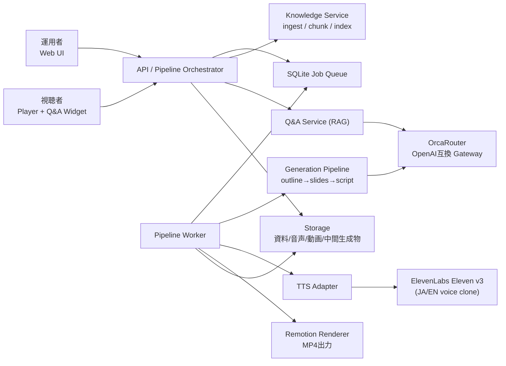

# Koebinar（コエビナー） システム仕様書

**ハッカソンMVP Technical Specification**

> *あなたの声が、あなたの代わりに登壇する。*

| 項目 | 内容 |
|---|---|
| 文書バージョン | v1.13 |
| 作成日 | 2026-08-08 |
| 対象フェーズ | ハッカソンMVP / Phase 1 |
| 文書区分 | ハッカソン開発用 |

> **プロダクト定義**
> 企業の資料・ナレッジから、ナレーション付きウェビナー動画（MP4）を自動生成し、視聴中の質問にも企業ナレッジで回答するAIウェビナーエージェント。

## 改訂履歴

| **版** | **日付** | **変更内容** | **作成者** |
|--------|----------|--------------|------------|
| 1.0 | 2026-08-08 | 初版（ChatGPT生成ドラフト） | Draft |
| 1.1 | 2026-08-08 | 動画生成パイプラインを中核仕様に再構成。OrcaRouter/Remotion/ElevenLabs/Irodori-TTSを確定。CRM・マルチテナント仕様を削除しPhase 2以降へ | チーム（要記入） |
| 1.2 | 2026-08-08 | TTSをElevenLabs（Eleven v3）へ一本化。TTS言語ルーティング・Irodori-TTSワーカー（GPU）を削除。同一クローンVoiceによる日英2バージョン生成を標準フローに追加 | チーム（要記入） |
| 1.3 | 2026-08-08 | ElevenLabs BYOK対応。Integrations API（キー登録/検証/削除、Voice一覧）、integrationsエンティティ（暗号化キー保存）、キー解決順序、検証フローを追加 | チーム（要記入） |
| 1.4 | 2026-08-08 | OrcaRouterもBYOK化し、Integrations APIを`{provider}`共通化。キー解決順序を全プロバイダー共通ルールに統一 | チーム（要記入） |
| 1.5 | 2026-08-08 | プロダクト名を「Koebinar（コエビナー）」に決定し全文書へ反映 | チーム（要記入） |
| 1.6 | 2026-08-12 | Web UI資料アップロード仕様（PDF/PPTXをブラウザ内抽出、§2.1）、追加指示`instructions`とKB紐付け厳格化（§3.2）を追加。B-stack（永続SQLite/非同期worker/Remotion経路）とWeb UI実装の反映 | チーム（要記入） |
| 1.7 | 2026-08-14 | ワークスペース認証、テナント分離、サイドバー、連携設定画面を追加。詳細は `tenant-auth-console.md` | チーム（要記入） |
| 1.8 | 2026-08-14 | 現行実装との整合性監査に基づき、非同期Worker構成、Step 2への追加指示の伝播、URL資料の扱いを明確化。PR #10の音声メディア・公開可否・Voice同意契約を反映し、未解消差分は `audit_report.md` に集約 | Codex |
| 1.9 | 2026-08-15 | BYOK登録時の外部プロバイダー検証エラーを422へ正規化する契約と、OrcaRouter / ElevenLabsの必要アクセス範囲を開閉可能なヒントで案内するUI仕様を追加 | Codex |
| 1.10 | 2026-08-15 | ElevenLabs登録検証をVoices Read必須・User Read任意へ変更し、安全な原因別エラーとメタデータ取得警告を定義 | Codex |
| 1.11 | 2026-08-15 | ElevenLabsの構造化エラーをallowlist方式で抽出・キー伏字化し、接続検証とTTS失敗理由へ安全に反映する契約を追加 | Codex |
| 1.12 | 2026-08-15 | BYOKフォームへElevenLabs `sk_`・OrcaRouter `sk-`の接頭辞検証とキーID誤コピー案内を追加 | Codex |
| 1.13 | 2026-08-15 | OrcaRouterの既定モデルを`orcarouter/auto`へ修正し、Chat固有失敗と保存キー認証失敗を再検証で分離 | Codex |

## 1. 仕様範囲・設計原則

本書は要件定義書v1.13のMust/Should要件を実装可能な粒度へ落とし込む。実装済みであることを示す文書ではなく、現行コード・テストとの差分は `audit_report.md` を正とする。

### 1.1 設計原則

- **OrcaRouter first**: 全LLM呼び出しはOrcaRouterのOpenAI互換エンドポイントを経由する。モデル選択はアダプティブルーティングに委ね、必要時のみモデル指定する。
- **Grounded by default**: 台本・Q&A回答はKB根拠を伴う。
- **Human override**: 台本は生成→人間確認→承認のフローを通せる。
- **Resumable pipeline**: 動画生成は段階（Step）単位で中間生成物を保存し、任意ステップから再実行できる（daida-ai流用）。
- **Single TTS provider**: TTSはElevenLabs（Eleven v3）に一本化する。ただし呼び出しは薄いAdapter interfaceの背後に置き、将来のエンジン追加（Irodori-TTS等）を妨げない。
- **BYOK first**: 外部プロバイダー（OrcaRouter / ElevenLabs）のAPIキーは運用者の持ち込みキーを第一とし、キーは常にサーバー側でのみ扱う。呼び出し時のキー解決順序は全プロバイダー共通で「①運用者の登録キー → ②システムのフォールバックキー（プロバイダー別構成フラグで有効時のみ）」とする。
- **Tenant boundary**: Bearer tokenからサーバー側でテナントを解決し、運用者データとBYOKを `tenant_id` で分離する。別テナントのID指定は404として扱う。
- **Reproducible**: 各生成物にmodel_id / prompt_version / 入力ハッシュを保存する。

## 2. システム構成



*図1. ハッカソンMVP論理アーキテクチャ*

### 2.1 資料アップロード仕様（Web UI、v1.6）

運用者は資料をブラウザで直接アップロードする。**テキスト抽出はすべてクライアント側で完結させ、サーバーは抽出済みプレーンテキストのみを受け取る**（理由はNFR-07/AR-01・requirements.md OD-11参照）。

| **形式** | **抽出方法** | **備考** |
|---|---|---|
| テキスト貼り付け / `.txt` / `.md` | そのまま送信 | 追加ライブラリ不要 |
| PDF | `pdf.js`（ブラウザ内）でページ単位にテキスト抽出 | スキャン画像PDF（テキスト層なし）はOCR非対応で不可。ページ間は空行区切りで結合し、チャンク分割の境界に利用する |
| PPTX | `JSZip` + `DOMParser`（ブラウザ内、いずれも追加の重量級依存なし）で `ppt/slides/slideN.xml` の `<a:t>` を抽出。スライド順は `presentation.xml` に従う | スピーカーノート（`ppt/notesSlides/`）も抽出し本文に含める |

抽出結果は `POST /api/v1/knowledge/documents` に `source_type="text"` として送信し、`metadata` に `{original_format, filename}` を保存する（プロブナンス目的、既存スキーマ変更なし）。API契約でも `source_type="text"` のみを受理する。現実装が受理する旧 `pdf/url` 擬似入力は監査A-013の解消対象とする。

アップロード制限: ファイルサイズ上限・PPTX展開後サイズ上限をクライアント側でチェックし、超過時は拒否する（zip bomb対策）。

URL資料の取り込みはMVPスコープ外（requirements.md OD-10、SSRFリスクのため）。

| **コンポーネント** | **責務** |
|---|---|
| Web App | 運用者UI（資料登録、台本編集、生成実行、プレビュー）、視聴者プレイヤー + Q&A Widget |
| Pipeline Orchestrator | Step状態管理、再実行要求、ジョブ投入。同期モードではAPIプロセス内実行 |
| Pipeline Worker | SQLiteジョブをclaimし、対象テナントの生成パイプラインを実行 |
| Knowledge Service | 抽出済みText登録、chunking、embedding、検索（現実装差分は監査A-012） |
| Generation Pipeline | アウトライン→スライド→台本の生成（OrcaRouter経由） |
| TTS Adapter | ElevenLabs API呼び出し、発音辞書適用、文単位合成、生成キャッシュ、クレジット消費の記録 |
| Remotion Renderer | スライドcomponent + 音声のタイムライン合成、MP4レンダリング |
| Q&A Service | RAG検索、回答生成、confidence判定、保留 |
| Storage | 抽出済み資料テキスト、chunk、音声、MP4、中間JSON |

## 3. 動画生成パイプライン仕様（中核）

daida-aiの6ステップ構成を流用し、Step 5-6をRemotionレンダリングに置換する。

| **Step** | **処理** | **入力** | **出力（保存される中間生成物）** |
|---|---|---|---|
| 1 | アウトライン生成 | テーマ、対象者、尺、KB検索結果 | outline.json（章立て、各スライドの目的） |
| 2 | スライド生成 | outline.json、テンプレート指定 | slides.json（Remotion component props）＋必要に応じ画像 |
| 3 | 台本生成 | slides.json、話法スタイル、KB根拠 | script.json（スライド別ナレーション文、参照文書ID） |
| 4a | TTSスクリプト整形 | script.json、発音辞書 | tts_script.json（文単位分割、読み補正適用済み） |
| 4b | 音声合成 | tts_script.json、voice_id、v3スタイル設定 | audio/*（レスポンス実形式に応じたMP3/WAV）＋durations.json（ElevenLabs、キャッシュ利用） |
| 5 | タイムライン構築 | slides.json + durations.json | timeline.json（スライド表示区間と音声の対応） |
| 6 | レンダリング | timeline.json、audio、slides | webinar.mp4 |

- 任意Stepからの再実行をサポートする（例: 台本修正→Step 4aから、発音修正→Step 4bの該当文のみ）。
- Step間の受け渡しはすべてJSONファイル/DBレコードとして永続化する。

### 3.1 daida-aiからの流用資産

| **資産** | **流用方法** |
|---|---|
| パイプライン段階設計・ステップ再実行 | 本仕様のStep構成として採用 |
| スライドテンプレート思想（tech/casual/formal） | Remotion componentのテーマとして再実装 |
| pronunciation_dict.tsv | 形式を踏襲しStep 4aで適用 |
| 話法スタイル（casual/keynote/formal/humorous） | 台本生成プロンプトのプリセットとして採用 |

※ daida-aiプラグイン本体（Claude Code対話型、PPTX出力）はプロダクトには組み込まない。PPTX出力が必要な場合の代替経路としてのみ検討する。

### 3.2 追加指示・資料の紐付け（v1.6）

- **`Webinar.instructions`（任意, string）**: 作成時に運用者が自由記述で入力する追加指示・重視点。`Step 1（アウトライン生成）` と `Step 3（台本生成）` の両方でLLMへの入力に含める（`operator_instructions` フィールドとして、`<kb>` の未信頼データとは明確に区別する）。Step 2もOrcaRouterを使うが、Step 1で追加指示を反映済みの`outline.json`を入力とし、`instructions`自体は重複送信しない。ステップ単体再実行時も同じ`instructions`値を再利用する（Webinarレコードに永続化するため）。
- **資料の紐付け厳格化**: `document_ids` は運用者が明示的に選択したものだけを対象とする。従来「未指定＝登録済み全資料を検索対象にする」実装だったが、複数ウェビナーを作るたびに資料が混ざる問題があるため撤廃する。`document_ids=[]`（0件選択）はKB根拠なしでの生成を意味し、台本の各スライドは`grounded=false`として扱われる（Step 3の既存フォールバック挙動をそのまま利用）。

## 4. OrcaRouter統合仕様

- 接続: OpenAI互換SDKで `base_url = https://api.orcarouter.ai/v1`。APIキーは**運用者の持ち込みキー（BYOK）**をintegrationsから復号して使用する。デモ用フォールバックキーは環境変数 `ORCAROUTER_API_KEY`（`ALLOW_SYSTEM_LLM_KEY=true` のときのみ使用）。
- キー検証: 登録時にモデル一覧取得（`GET /v1/models`）で有効性と参照権限を確認する。外部プロバイダーの401/403/429/5xxや通信失敗は、秘密情報を含まない `422 OrcaRouter APIキーを検証できませんでした` へ正規化し、検証前のintegrationを作成・更新しない。残高・レート上限の照会APIが利用可能であれば併用する（要確認: OD-09）。
- 保存・再検証: 登録成功後のキーはテナント別に暗号化してSQLiteへ永続化し、APIの別リクエストと非同期Workerから復号する。Chat 401/403はモデル・権限・workspace・budget固有の可能性があるため、それだけでintegrationを`invalid`にしない。同じキーで`GET /v1/models`を再実行し、こちらも401/403の場合だけ無効化する。
- 権限案内: 入力欄付近のキーボード操作可能な`[i]`ヒントに、接続確認の`GET /v1/models`、生成の`POST /v1/chat/completions`、モデル参照・チャット生成権限、有効期限・利用上限・IP制限を表示する。
- ルーティング: 既定モデルIDは公式のAuto Routerである`orcarouter/auto`とし、環境変数`KOEBINAR_LLM_MODEL`で上書き可能にする。`adaptive`はHosted APIの公開モデルIDではないため使用しない。台本生成など品質重視の呼び出しのみ明示モデルを許可する。
- エラー表示: OrcaRouterのJSON応答から構造化された`error.code/type/message`だけを抽出し、キー全文を`[redacted]`へ置換して長さを制限する。非構造化本文は画面・API・ログへ転送しない。
- 構造化出力: outline/slides/script/Q&Aは`response_format={"type":"json_object"}`を第一選択とする。OrcaRouter公式仕様ではAnthropic upstreamは`response_format`非対応のため、`error.code=api_not_implemented`の400に限り、JSON出力を指示済みの同一プロンプトから`response_format`を外して1回再送する。他の400は再送しない。JSON object以外または不正JSONはStep失敗として扱う。
- ガードレール: PII Shield、Prompt Injectionガードを有効化する（利用可能なプランの範囲で設定）。
- 可観測性: 各運用者のOrcaRouterダッシュボードを一次のコスト・レイテンシ記録とし（BYOKのため運用者自身が自分の消費を確認できる）、アプリ側はrequest_id/model_id/prompt_versionのみ保存する。
- フェイルオーバー: OrcaRouterの自動フェイルオーバーに依存する。アプリ側はconnect/read/write/pool timeoutを分離し、非streamの長尺生成に対するread timeoutを`KOEBINAR_ORCAROUTER_READ_TIMEOUT_SEC`（既定600秒）で調整可能にする。Hosted APIの公式推奨秒数ではなく、OpenAI互換SDKの長時間応答を許容する運用既定値である。Read/Connect timeout、408/409、再試行可能な5xxは短い指数backoffで1回だけ再試行する。429は`Retry-After`（秒）が安全な待機上限内の場合だけその値を待って1回再試行する。400/401/403/404/425、`model_not_found`、`byok:key_unavailable`、`Retry-After`なしの429は同一要求を再試行しない。
- embeddings: OrcaRouter経由を第一候補とし、対応不可の場合のみ直接プロバイダー呼び出しを許可（構成フラグで管理、要件AI-01の例外）。

## 5. TTS仕様（ElevenLabs Eleven v3 一本化）

### 5.1 TTS Adapter Interface

```
synthesize(text: str, lang: "ja"|"en", voice_id: str, style: dict) -> AudioSegment
```

MVPの実装はElevenLabsのみだが、interfaceは維持し将来のエンジン追加を妨げない。

| **項目** | **仕様（日英共通、差分は言語欄に記載）** |
|---|---|
| モデル | Eleven v3を既定とする（特に日本語品質のため）。速度優先の検証用にFlash系への切替フラグを持つ |
| 声の指定 | Instant Voice Cloneで登録したvoice_id。**日英とも同一voice_idを使用**し「本人の声のまま2言語」を実現する |
| 分割方針 | 日本語: **文単位**（漢字読み誤りの局所化とリテイク容易性のため）。英語: 段落単位可 |
| 読み補正 | 発音辞書TSV（daida-ai形式を踏襲）をStep 4aで適用。日本語は読み誤りやすい固有名詞・専門用語をカナ置換 |
| 感情/スタイル | v3のスタイル指示・voice settingsで調整。台本生成時にスタイルヒントを付与可能 |
| 生成戦略 | オンデマンド＋**生成キャッシュ**（同一テキスト×voice×settingsのハッシュで再利用）。デモ分は事前生成 |
| コスト管理 | 文字数からクレジット消費を事前見積りし、generation_logsに記録。プラン上限に対する消費率を可視化 |

### 5.2 BYOK（APIキー持ち込み）仕様

キー管理はOrcaRouterと共通のintegrations機構を使う（暗号化保存・マスク表示・キー解決順序は設計原則および第4章と同一）。本節ではElevenLabs固有の検証・Voice連携を定義する。

- **キー登録**: 運用者は設定画面から自分のElevenLabs APIキーを登録する。登録時に以下を検証する:
  1. ブラウザで接頭辞`sk_`を検証し、不一致ならキーIDではなくAPIキー全文をコピーするよう表示して送信しない。OrcaRouterも同様に`sk-`を検証する
  2. `GET /v1/voices` の呼び出し可否でキーの有効性とVoices Readスコープを確認する。この検証はTTSクレジットを消費しない
  3. `GET /v1/user/subscription` は任意で呼び出し、`User Read`（`user_read`）が許可されていればtier・status・文字数残量（character_count / character_limit）を取得する。User Readがない場合も登録は成功させ、プラン・使用量が表示できない旨を警告する
  4. TTSエンドポイントのText to Speechスコープは課金を避けるため登録時には呼び出さず、初回生成時に確認する
- **検証エラー契約**: 必須のVoice一覧検証で発生した401/403/429/5xxや通信失敗は、原因別detail（キー無効・期限切れ/Voices Read・IP allowlist/レート制限/一時障害/接続失敗）を持つ422へ正規化する。ElevenLabsのJSON応答は構造化された`detail.status/code/type`、`detail.message`、`detail.request_id`だけを抽出し、キー全文を`[redacted]`へ置換して各フィールドの長さを制限する。非構造化本文は表示しない。接続検証では安全化したcode/messageを画面へ表示し、TTS失敗では同じ安全化済み理由をウェビナー/ジョブのエラーへ記録する。KoebinarのBearer認証401とは区別し、ブラウザのログインセッションを維持する。検証失敗時は既存integrationを作成・更新しない。
- **プラン警告**: User Readがある場合はproviderから取得したtierと使用量を表示する。権限がない場合または任意照会が一時失敗した場合は、接続を妨げず取得不能の警告を表示する。公開・商用利用・クレジット表記等の条件は利用時点の契約と規約を確認するよう案内し、Free tierと判定できた登録は確認の上でのみ許可する。
- **保存**: キーはアプリ層で暗号化（マスターキーは環境変数管理）してDB保存。復号はTTS呼び出し直前のサーバー側処理のみ。APIレスポンス・UI・ログには`sk_...`末尾4桁のマスクのみ。
- **Voice同期・選択**: 登録キーで`GET /v1/voices`を呼び、Voice一覧（クローンVoice含む）をテナントスコープで同期する。一覧取得は同意を付与しない。運用者が動画生成に使うvoice_idを選択し、APIは現在テナントの有効かつ利用可能なVoiceかを検証する（作成UIの未実装差分は監査A-004）。
- **削除/差替え**: キー削除時は該当integrationのvoice_refsを無効化する。キー差替え後に同一テナント・同一provider Voice IDが再同期された場合は、同意対象が変わらないため有効な証跡を維持し、新しいintegrationへ関連付ける。生成済み音声・動画は保持する。
- **フォールバック**: BYOK未登録の場合、構成フラグ `ALLOW_SYSTEM_TTS_KEY=true` のときのみシステムキーで生成可能（デモ・開発用。生成物に「デモ用共有アカウント」フラグを付与）。OrcaRouter側は `ALLOW_SYSTEM_LLM_KEY` で同様に制御する。
- **推奨案内**: 入力欄直下にElevenLabsは`sk_`、OrcaRouterは`sk-`から始まることを常時表示する。キーボード操作可能な`[i]`ヒントには、接続確認で必須の`GET /v1/voices`（Voices Read）、プラン・使用量表示に任意の`GET /v1/user/subscription`（User Read / `user_read`）、生成の`POST /v1/text-to-speech/{voice_id}`（Text to Speech）、有効期限・IP allowlist・スコープ制限・クレジット上限、Freeプラン確認欄との関係を表示する。ヒントはモバイルviewport外へはみ出さない。

### 5.3 制約・運用

- providerに登録済みのクローン/custom/未知カテゴリVoiceは、運用者が話者本人の同意取得と利用条件を確認し、Voiceごとに明示attestationを記録するまで使用不可とする。既知のpremade Voiceだけを`not_required`とし、旧`consent_flag=true`や証跡sourceのないデータは同意として扱わない。
- 証跡は`tenant_id`、`voice_id`、`consent_source=operator_attestation`、`attested_at`、`attested_by`、`attestation_version`を保持する。ウェビナー作成、ジョブ実行、TTS外部呼び出し直前で所属・active・証跡をfail-closedに検証する。
- 同意取消は証跡を無効化して以後の生成を拒否するが、既存ジョブの取消操作とは独立に扱う。生成済み音声・動画は削除しない。
- 音声はレスポンスbytesの実形式を検査し、MP3/WAVの正しい拡張子・MIME・durationで文ごとに保存する。リテイク時は該当音声のみ差し替え、Step 5以降を再実行する。
- ElevenLabs障害・クレジット枯渇時のデモ保険として、edge-tts等へのフォールバックを構成フラグで切替可能にする（品質低下許容、クローン声は失われる）。
- 日本語TTSの表現力強化（絵文字感情制御等）が必要になった場合は、Phase 2でIrodori-TTSのサーバーレスGPUホスティングを再評価する（本Adapter interfaceへの追加実装で対応可能）。

## 6. Remotionレンダリング仕様

- スライドはReact componentとして実装し、`slides.json`のpropsで内容を注入する。
- テーマ: tech（ダーク/シアン）、casual（暖色/丸み）、formal（白基調）。フォントはNoto Sans CJK JP / Noto Serif CJK JP。
- タイムライン: `durations.json`から各スライドのdurationInFramesを算出（30fps）。音声は`<Audio>`でスライド区間に配置。
- 出力: 1080p / 30fps / H.264 MP4。ローカル`@remotion/renderer`でレンダリング。尺・解像度は構成値。
- 成果物確定: 一時ファイルへレンダリングし、`ffprobe`で映像・音声ストリームと構成尺を検査してから原子的に`webinar.mp4`へ確定する。Remotionまたはprobe失敗はStep失敗とし、テストダブルへ自動フォールバックしない。
- 公開条件: `renderer=remotion`、`test_only=false`、`publishable=true`、probe成功、成果物実在をすべて満たす場合だけ公開可能とする。
- 字幕（Could）: script.jsonから字幕トラックを焼き込みまたはVTT出力。

## 7. Q&A（RAG）仕様

v1.0の設計を簡素化して踏襲する。

- Retrieval: vector similarity（＋余力があればBM25 hybrid）。Top 10取得→Top 5をcontextへ。
- 構造化出力（OrcaRouter経由、JSONモード）:

| **Field** | **Type** | **説明** |
|---|---|---|
| answer_text | string | 視聴者向け回答 |
| confidence | number 0..1 | 保留判定用 |
| citations | array | document_id / chunk_id |
| answerability | enum | answerable / insufficient / restricted |
| intent | object? | Intent Signal（簡易分類ラベル） |

- Confidence Gate: citationなし、またはconfidence < 0.7（初期値）は定型保留文を返す。モデレーションキューは設けない（Phase 2）。
- ガードレール: OrcaRouter側ガードを第一層、システムプロンプトでの入力分離を第二層とする。

## 8. API仕様（MVP）

REST/JSON、`/api/v1`。運用者APIはワークスペース固有のBearer token、公開視聴APIは認証不要とする。

| **Method** | **Path** | **用途** |
|---|---|---|
| POST | /api/v1/auth/login | ワークスペースID＋アクセストークンの検証（認証不要） |
| GET | /api/v1/auth/session | 現在の認証テナント取得（Bearer必須） |
| POST | /api/v1/knowledge/documents | 抽出済みテキスト資料の登録。Web UIはPDF/PPTX/Textを`source_type=text`で送る。URLは受理しない（現実装差分は監査A-013） |
| POST | /api/v1/webinars | ウェビナー生成ジョブ作成（テーマ、尺、言語、voice、テンプレート） |
| GET | /api/v1/webinars/{id} | ジョブ状態・中間生成物取得 |
| PATCH | /api/v1/webinars/{id}/script | 台本修正 |
| POST | /api/v1/webinars/{id}/steps/{step}/run | 指定ステップから再実行 |
| GET | /api/v1/webinars/{id}/video | MP4取得/署名URL |
| PATCH | /api/v1/webinars/{id}/publication | 完成ウェビナーの公開・公開停止（運用者認証必須） |
| GET | /api/v1/public/webinars/{id} | 公開済みウェビナーの視聴用メタデータ（認証不要、運用情報を除外） |
| GET | /api/v1/public/webinars/{id}/video | 公開済みウェビナーのMP4（認証不要） |
| POST | /api/v1/public/webinars/{id}/questions | 公開済みウェビナーへの視聴者質問（認証不要） |
| GET | /api/v1/public/webinars/{id}/questions/{question_id} | 公開ページの回答取得（認証不要、ウェビナー所属を検証） |
| POST | /api/v1/integrations/{provider} | キー登録（provider: orcarouter / elevenlabs。登録時検証を実行し、検証結果・警告を返す。外部プロバイダー検証失敗は安全なdetailの422） |
| GET | /api/v1/integrations | 全プロバイダーの接続状態取得（キーはマスク表示、検証日時、ELはtier・残量含む） |
| DELETE | /api/v1/integrations/{provider} | キー削除（ELは関連voice_refs無効化） |
| GET | /api/v1/integrations/elevenlabs/voices | ElevenLabs登録キーのアカウントのVoice一覧取得 |
| POST | /api/v1/integrations/elevenlabs/voices/{voice_id}/consent | クローン/custom Voiceの明示的な利用同意証跡を記録 |
| DELETE | /api/v1/integrations/elevenlabs/voices/{voice_id}/consent | Voiceの利用同意証跡を取り消し、以後の生成を拒否 |
| POST | /api/v1/questions | 運用者用の質問作成（簡易トークン必須） |
| GET | /api/v1/questions/{id} | 運用者用の回答取得（簡易トークン必須） |
| GET | /api/v1/analytics/questions | 質問・Intent一覧、CSV/JSONエクスポート |

`POST /api/v1/webinars` はv1.6で`instructions`（任意, string）を受け付ける。`document_ids`は明示的に選択したもののみを渡す（未指定/空配列＝KB根拠なしで生成、3.2参照）。視聴者ページは完成後の明示的な公開操作を必須とし、公開APIからはvoice_id、instructions、document_ids、script、artifacts等の運用情報を返さない。

## 9. データモデル

| **Entity** | **主要Field** |
|---|---|
| knowledge_documents | id, **tenant_id**, title, source_type, storage_uri, status, metadata（`original_format`/`filename`等、v1.6でクライアント抽出資料のプロブナンスを保持） |
| chunks | id, **tenant_id**, document_id, text, embedding_ref, section |
| webinars | id, **tenant_id**, theme, audience, duration_min, lang, template, style, voice_ref, status, current_step, **instructions**（v1.6追加、自由記述の追加指示） |
| pipeline_artifacts | id, **tenant_id**, webinar_id, step, type(outline/slides/script/tts_script/audio/timeline/video), storage_uri, model_id, prompt_version, created_at |
| integrations | id, **tenant_id**, provider(orcarouter/elevenlabs), encrypted_api_key, key_mask, status, validated_at, meta_json（EL: tier/character_count/character_limit等のプロバイダー固有情報） |
| voice_refs | tenant_id, integration_id, provider(elevenlabs), voice_id, category, active, consent_status, consent_source, attested_at, attested_by, attestation_version, revoked_at, synced_at |
| questions | id, **tenant_id**, webinar_id, message, status, created_at |
| answers | id, **tenant_id**, question_id, text, confidence, answerability, citations_json, model_id, prompt_version |
| intent_signals | id, **tenant_id**, question_id, type, value, confidence |
| generation_logs | id, **tenant_id**, request_id, purpose, model_id, prompt_version, cost_hint, created_at |

## 10. エラー/例外処理

| **ケース** | **システム動作** | **表示/運用** |
|---|---|---|
| OrcaRouter timeout | 1回リトライ後、Step失敗として停止 | 該当Stepから再実行可能 |
| ElevenLabs APIエラー | 指数バックオフで2回リトライ。該当文をリテイクキューへ | 運用者に通知 |
| キー登録時の外部プロバイダー検証失敗（provider側401/403/429/5xx等） | Koebinar APIは安全なdetailの422を返し、integrationを作成・更新しない。オペレーターセッションは維持 | 連携設定画面内でキー・権限・期限・IP制限等の確認を案内 |
| 保存済みOrcaRouterキーのChat 401/403 | `GET /v1/models`で再検証し、こちらも401/403の場合だけintegration.status=invalidへ更新 | Chat固有のcode/messageを安全化して表示。モデル・権限・workspace・budgetを確認 |
| 保存済みElevenLabsキーの実行時401/403 | integration.status=invalidに更新し該当機能の生成停止 | 再登録を案内 |
| 持ち込みキーのスコープ不足・権限エラー（403） | 生成停止 | 必要権限の設定手順を案内（EL: TTS/Voices読み取り） |
| 持ち込みOrcaRouterキーの残高不足 | 生成失敗として停止 | 残高確認・チャージを案内。デモ時はフォールバックキーで継続 |
| ElevenLabsクレジット枯渇 | キャッシュ利用、未生成分は保留。フォールバックTTSを提案 | 運用者に通知 |
| Voice未同期・無効・同意未記録/取消済み | ウェビナー作成、ジョブ実行、TTS呼び出しを拒否 | Voice同期と明示同意を案内 |
| Remotionレンダリング失敗 | ログ保存、timeline.jsonから再実行 | 中間生成物は保持 |
| Retrieval hitなし（Q&A） | 回答せず保留文 | 「担当者が確認します」 |
| 台本のKB根拠なしスライド | 警告フラグ付与 | 台本編集画面で強調表示 |

## 11. セキュリティ仕様（MVP最小）

- システム保有キー（OrcaRouter/フォールバックTTS）は環境変数管理。リポジトリへのコミット禁止（gitleaks等をCIに追加推奨）。
- 運用者トークンに既定値を設けず、起動時の環境変数で必須設定する。公開Webバンドルへトークンを埋め込まない。
- 公開Q&AはクライアントIP＋ウェビナー単位で回数制限する。単一プロセスMVPのインメモリ制限であり、水平分散時は共有ストア型limiterへ置き換える。
- 公開Q&AのIPはASGIサーバーが確定した `request.client` を使う。リバースプロキシ配下ではUvicornの `--forwarded-allow-ips` を実際のプロキシIPだけに設定する。未設定の共有プロキシ配下では全視聴者が同一IP扱いになるため、直公開または信頼済みプロキシ設定をMVPの前提とする。
- 持ち込みキー（OrcaRouter / ElevenLabs）はいずれもアプリ層暗号化でDB保存。平文ログ・フロント返却を禁止し、マスク表示（末尾4桁）のみ。外部API呼び出しは必ずバックエンドから行い、キーをブラウザへ渡さない。
- クローン/custom Voiceは一覧取得と同意付与を分離し、テナントスコープの明示証跡がない限りfail-closedにする。取消後は以後の生成を拒否する。生成動画にAI生成表記を焼き込む。
- KB由来テキストはuntrusted dataとしてプロンプト内で明示的に区切る。OrcaRouterのガードレールを併用する。
- デモ用資料にPII・機微情報を含めない運用ルール。

## 12. テスト仕様

| **テスト種別** | **対象** | **主要判定** |
|---|---|---|
| Unit | TTS Adapter、音声形式、タイムライン計算、発音辞書、Voice同意状態 | 決定論的ロジックとfail-closed境界をカバー |
| Integration | OrcaRouter呼び出し（BYOK検証含む）、ElevenLabs API（BYOK・Voice同意検証含む）、Remotionレンダリング | 正常系＋timeout/クレジット超過/残高不足/429/401/403、音声・映像probe、公開拒否 |
| E2E | 資料→MP4の全パイプライン | JA/EN各1本の生成完遂 |
| RAG Evaluation | Golden Q&A 20件 | groundedness、保留動作 |
| 台本品質 | サンプル資料での台本生成 | KB根拠のない記述の検出 |

## 13. デプロイ/運用（ハッカソン）

- 構成: モノレポ（web / api / renderer）。docker composeで起動可能にする。TTSはapi内のAdapterモジュールとし、専用ワーカーは設けない（GPU不要）。
- 事前生成: 審査デモ用に主要動画は事前レンダリングし、当日はライブ生成＋キャッシュ再生の二段構えとする。
- プロンプト管理: prompts/ディレクトリでバージョン管理し、prompt_versionとして記録する。

## 14. 拡張仕様（Phase 2以降・v1.0からの引き継ぎ）

v1.0で定義されていた以下の仕様は、Phase 2以降の設計資産として保持する（本MVPでは実装しない）。

| **拡張** | **v1.0該当** | **MVPで準備している接続点** |
|---|---|---|
| 外部ウェビナー基盤連携 | Webhook/Event仕様、冪等性 | questions APIをWebhook受信に拡張可能 |
| Intent Scoring本実装 | Signal weight/decay、Score式、CTA rule | intent_signalsテーブル |
| CRM Agent | HubSpot/Salesforce Tool、idempotency | エクスポートAPIの置換 |
| モデレーション | Moderator Console | answers.status設計 |
| リアルタイムAIアバター | Presenter Adapter (speak/pause/show_slide) | script.json/timeline.jsonの再利用 |
| 日本語TTS強化 | Irodori-TTS（サーバーレスGPU、絵文字感情制御） | TTS Adapter interface、発音辞書、文単位wav管理 |
| テナント内RBAC・SSO | 5ロール、IdP連携 | 実装済みのtenant_id境界と認証主体を拡張 |
